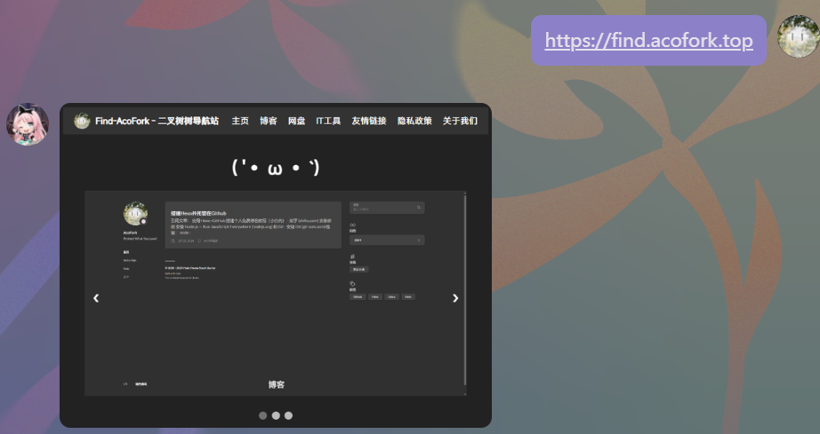

# nonebot-plugin-webpreview
webpreview是一个适用于NoneBot的网页预览插件，使用pyppeteer调用本地的Chrome进行网页预览截图发送。所有代码均使用GPT构建

## 安装教程
 - 前往最新的Release，下载`webpreview.xxx.py`文件
 - 将下载的 `webpreview.xxx.py` 放入你的NoneBot的`plugins`文件夹即可
   
## 使用教程
 - 请先更改插件代码的浏览器路径处（默认适用于Windows的Chrome）
   ```
   # Chrome 可执行文件路径
   CHROME_PATH = r'C:\Program Files\Google\Chrome\Application\chrome.exe'
   ```
 - 插件第一次载入时，可能会报错`no module named pyppeteer`，请在你的NoneBot环境（大部分情况是虚拟环境）执行
   ```
   pip install pyppeteer
   ```
 - 直接发送带`HTTP` `HTTPS`的链接即可预览图片，如图

## 例图

